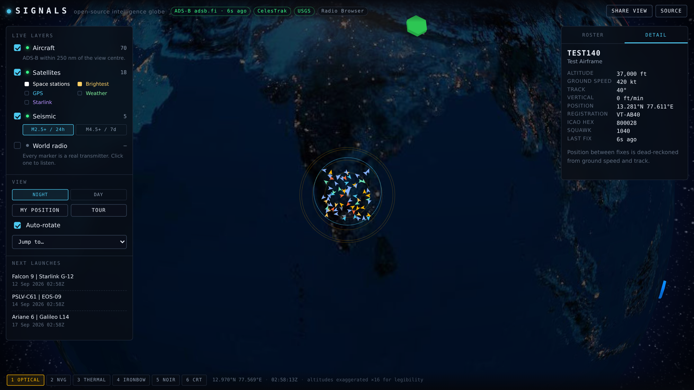

# 🌐 SIGNALS

**A live 3D globe of public signals — aircraft, satellites, earthquakes and world radio — with no API keys, no server and no build pipeline to run.**

Open the page and you are looking at real telemetry: ADS-B transponders from community receiver networks, orbital elements propagated in your browser with SGP4, USGS seismic feeds, and geolocated radio transmitters you can actually listen to. Everything is fetched directly by the browser from open endpoints. There is no backend, because there is no secret to keep.



*Screenshot captured against the test fixtures, so the callsigns are synthetic. Everything else — the globe, the orbital positions, the layout — is the real thing.*

---

## What's on the globe

| Layer | What you get | Source | Key |
|---|---|---|---|
| ✈️ **Aircraft** | Live ADS-B within 250 nm of wherever the camera is pointed: altitude-coloured glyphs oriented along their true heading, dead-reckoned between fixes, click-to-track with a trail and a full telemetry card | adsb.fi → airplanes.live → adsb.lol | none |
| 🛰️ **Satellites** | Space stations, brightest objects, GPS, weather and a Starlink slice — positions computed live with SGP4, one-revolution ground tracks, and pass predictions for your own location | CelesTrak | none |
| 🌍 **Seismic** | Global earthquakes for the last 24 hours or the last week, sized by magnitude and coloured by depth, with expanding pulses on anything M5+ | USGS | none |
| 📻 **World radio** | Hundreds of transmitters at their real coordinates. Click one and it plays | Radio Browser | none |
| 🚀 **Launches** | The next rockets off the pad | Launch Library 2 | none |

Six sensor looks (optical, NVG, thermal, ironbow, noir, CRT), a night or daylight basemap, a cinematic tour, and a share link that encodes the camera, the active layers and the sensor you were using.

## Run it

```bash
git clone <this repo>
cd signals
npm install
npm run assets     # copies the globe textures out of three-globe
npm run build      # bundles js/ into dist/app.js
npm run serve      # http://localhost:4173
```

`dist/app.js` and `assets/` are committed, so the published site needs none of the above — any static host will serve this directory as-is. `npm run watch` rebuilds on change while you work.

### Keyboard

`1`–`6` sensor look · `F` aircraft · `S` satellites · `E` seismic · `R` radio · `T` tour · `Space` auto-rotate · `Esc` deselect

### Console

The app leaves a handle on `window.SIGNALS`. `SIGNALS.flights.contacts`, `SIGNALS.sats.active()`, `SIGNALS.globe.flyTo(35.68, 139.69, 0.4)` — it is meant to be poked at.

## How it works

```
index.html          markup and chrome
css/style.css       the whole UI
js/
├── main.js         orchestration: boot, render loop, selection, sharing
├── config.js       every endpoint and tunable in one file
├── globe.js        globe.gl + three.js scene, glyph geometry and orientation
├── ui.js           DOM rendering — no network, no globe
├── util.js         geodesy, fetch-with-timeout, TTL cache, formatting
└── layers/
    ├── flights.js  ADS-B ingest, source failover, dead reckoning, trails
    ├── satellites.js  TLE parsing, SGP4 propagation, ground tracks, passes
    ├── quakes.js   USGS GeoJSON
    └── radio.js    Radio Browser mirrors and playback
```

Four things in here were more interesting than they look:

**Headings that survive the camera.** An aircraft glyph has to point along its real-world track from every camera angle — orbit the globe and it must not pinwheel. Each object is placed in a local frame where `+X` is east, `+Y` is north and `+Z` is up, the glyph is authored nose-along-`+Y`, and it is then rotated about the local vertical by `-track`. The test suite recovers each glyph's forward axis from its world matrix and checks it against the reported track; the error is zero across every contact it samples.

**Smooth motion from choppy data.** ADS-B feeds land every 15–30 seconds. Rather than teleport aircraft on each poll, every contact is projected forward from its last known fix along its track at its ground speed, so the scene moves continuously. The detail panel says so rather than implying the position is observed.

**Nothing blocks anything.** Each layer owns its polling, its failures and its status. If the radio directory is down, the aircraft keep flying; if every ADS-B mirror refuses, the globe still spins and the chip at the top turns red. Sources are tried in order and the one that answered last time is tried first.

**Glyphs sized by camera distance.** The camera sits `altitude × R` above the surface with a 50° field of view, so world-space glyph size is scaled with altitude to hold roughly constant on screen. Otherwise an aircraft is a sub-pixel speck from orbit and covers a city from close in.

## Tests

```bash
npx playwright install chromium   # first time only
npm run build
node scripts/smoke.mjs            # boots the page offline, asserts it survives dead feeds
node scripts/test-live.mjs        # intercepts every feed with fixtures and exercises the render path
```

`test-live.mjs` checks aircraft ingest and source failover, SGP4 output against known ISS values, glyph heading recovery, dead reckoning actually moving contacts, roster and detail rendering, satellite ground tracks, radio markers, and the mobile bottom-sheet behaviour — and fails on any page error.

## Honesty about the data

This is an exploratory visualisation of public feeds, not an operational tool.

- **Coverage is uneven.** Community ADS-B depends on volunteer receivers. Oceans and much of the global south are thin or empty. An absence of aircraft is an absence of receivers, not an absence of traffic.
- **Altitudes are exaggerated ×16** so they read at globe scale. The HUD says so on screen.
- **"Military" is a hint.** It comes from the ICAO hex allocation block. It catches known ranges and misses plenty, and it is used only to colour a glyph.
- **Positions between fixes are computed, not observed** — see dead reckoning above.
- **Satellite positions are propagated**, and SGP4 accuracy degrades as elements age. TLEs are cached for six hours.
- **Only https radio streams are offered.** A plain-http stream would be blocked as mixed content on an https page and fail silently.

Do not use any of this for navigation, emergency response, or anything where being wrong matters.

## Privacy

There is no analytics, no tracking and no backend. "My position" uses the browser geolocation prompt, is held in memory for the session, and is used only to centre the camera and compute satellite passes. Nothing is transmitted anywhere.

## Built on

[globe.gl](https://github.com/vasturiano/globe.gl) and [three.js](https://threejs.org) for the scene, [satellite.js](https://github.com/shashwatak/satellite-js) for SGP4, [esbuild](https://esbuild.github.io) for the bundle. Textures ship with [three-globe](https://github.com/vasturiano/three-globe) (NASA imagery).

Inspired by [God's Eye View](https://github.com/bilawalsidhu/gods-eye-view) by Bilawal Sidhu — this is a much smaller, static, keyless take on the same idea, built to be readable in an afternoon.

Bundled and live data carries its own terms: [adsb.fi](https://adsb.fi), [airplanes.live](https://airplanes.live), [adsb.lol](https://adsb.lol), [CelesTrak](https://celestrak.org), [USGS](https://earthquake.usgs.gov), [Radio Browser](https://www.radio-browser.info), [Launch Library 2](https://thespacedevs.com). Please be considerate with polling if you fork this.

MIT licensed.
